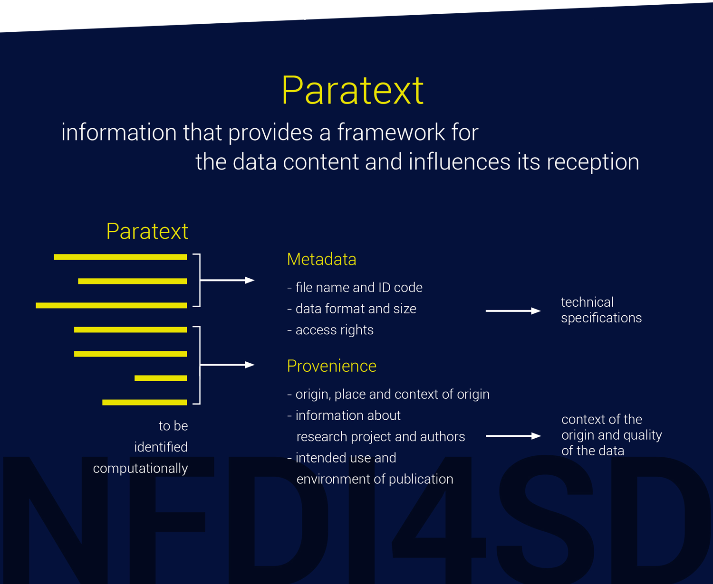

## Metadata

Besides the content data, the paratext of research data contains different types of additional metadata. Citing the recommended metadata of the RDA,[^rda] and OpenAIRE:[^oair1]

>Metadata is data providing information about data that makes findable, trackable and (re)usable. It can include information such as contact information, geographic locations, details about units of measure, abbreviations or codes used in the dataset, instrument and protocol information, survey tool details, provenance and version information and much more.

The recommended set of paratext data will be regularly discussed by the NFDI4SD in workshops and expert consultations. Metadata will satisfy the required core (e.g. Dublin core,  Datacite and OpenAIRE). We, therefore, apply the proposal of [Datacite](http://schema.datacite.org/meta/kernel-4.3/doc/DataCite-MetadataKernel_v4.3.pdf). We share the experience our data aggregation that oversize sets of metadata and standardised ontologies only play a subordinate role for the disciplines. A standardisation of terminology and meaning will still be a closely controlled part of the data preparation process.

## Ontologien / CIDOC / Referenzdaten

NFDI4D will optionally provide a rich portfolio of machine processed ontologies (comparable to [Achres](https://arches.readthedocs.io/en/latest/ontologies-in-arches/)), e.g. CRM (Conceptual Reference Model ([CIDOC](http://www.cidoc-crm.org/)). The bottom-up model of semantic frameworks and their inferential processing preferred by NFDI4D always provides for a review of their application areas by the project itself. The machine learning algorithms based on this model must always show their quality metrics against the annotated reference data set. These reference data are themselves ideally published research data, manually selected and checked by the researchers.

Following considerations will be taken into account:

  - Paratext data will best be coded as [JSON-LD](https://json-ld.org/) format, which as a lightweight Linked Data format allows a standardized API for complex hierarchical data structures. Its standards are ideal for an interoperable API, REST-services and Web interface.[^ld]Transformations into other formats and standards are planned.
  - Core metadata, as required by ZENODO and generic data repositories, will be included in the set of metadata.
  - Paratext will consist of the provenance of data to allow the composition of a data dependency graph. It will enable functions for the NFDI4SD registry to administer data dependencies and informative navigation through data repositories to the researcher.
  - Many data provider - e.g. Bayerischer Staatsbibiothek München - as a pivotal content provider for digital ressources, has tagged exceptionally well their more than 2.5 mio digital objects and provides various RDF and XML structured metafiles. Their schema will be transparently used for the subsequent processing of research data for our researcher. A maximum of coherence of data and metadata is intended.
  - Meaningful data APIs will be created along the lines of [API](https://rollout.io/blog/json-ld-building-meaningful-data-apis/) considerations.
  - Machine learning tools of the NFDI4SD will supply flexible mapping between user-specific terminology and data standards.
  - Sufficient documentation of data, their origin, units, explanation of terms and cross-linking to standards of definition are recommended and will be assisted by appropriate tools using research feedback from the specific research community.
  - There is a discussion about the advantage of [Structured Data Transformation (SDTL)](https://ddialliance.org/announcement/public-review-structured-data-transformation-language-sdtl) which addresses the issue of data provenance.[^sdtl1] A proposal is under review.

# NFDI4D *Standards-Companion*

The proven and widely used services such as Zenodo, reference data, programming languages and ontologies already presuppose a rich set of standards and norms for the data used. A computational tools will assist researchs in choosing a suitable set of standards and ontologies.

Some examples of popular metadata standards, both general and domain specific:

- Dublin Core - domain agnostic, basic and widely used metadata standard
- DDI (Data Documentation Initiative) - common standard for social, behavioral and economic sciences, including survey data
- EML (Ecological Metadata Language) - specific for ecology disciplines
- ISO 19115 and FGDC-CSDGM (Federal Geographic Data Committee's Content Standard for Digital Geospatial Metadata) - for describing geospatial information
- MINSEQE (MINimal information about high throughput SEQeuencing Experiments) - Genomics standard
- FITS (Flexible Image Transport System) - Astronomy digital file standard that includes structured, embedded metadata
- MIBBI - Minimum Information for Biological and Biomedical Investigations
Where no appropriate, formal metadata standard exists, for internal use, writing “readme” style metadata is an appropriate strategy.
If you need more information, check the following resources:
- DCC Metadata Standards
- RDA Metadata Directory

Other standards and ontologies:

- Zenodo API
- PID systems
- JSON-LD
- UTF 8
- CIDOC[^cd]
- Schema.org

Researchers are not expected to master all these standards themselves and to be able to judge the advantages and disadvantages of other standards.

Disciplines therefore develop or use their own specific terminologies, whereby research data distributed over various contexts of origin accumulates a conceptual vagueness that creates difficulties in the uncritical use of simple terminology. Linked Open Data (LOD) should therefore go beyond the sole use of ontologies and move from the possibilities of machine learning to the tested use of vague concepts. Mees, Thiery and Unold have convincingly pointed out use cases of provincial Roman archaeology and many others no subject. [^33]

[^33]: [@unold2019]

In order to offer the development as well as the use of the rich standards to researchers as a service, NFDI4SD is developing a *Standards-Companion*. Analogous to the Companion on legal standards, NFDI4SD is developing a Standards-Companion, which classifies the registered research data with the means of machine learning on the application of standards and directly generates an automated report on the standards used, their reference pages and further literature via the virtual research bench. Alternative standard concepts are also reported. The Standards-Companion constantly updates its own database and in this way ensures the harmonisation of research data. The data sources for the Standard-Companion are in particular

- Formal models of the standards
- Labeled data for machine learning

## Provenience

Data provenience will become part of the paratext of research data. It will be gathered by compiling a dependency graph between research data objects as described in either narrative publications or the analysis of computational notebooks. Each research data object will carry a unique identifyer and reference in research publication establish the dependencies between them. NFDI4SD registry will build up a large dependency graph for research data that will be the basis of supporting the cataloging and reuse of research data.

[^cd]: [@]

[^ld]:[Information about json-ld linked data](https://json-ld.org/learn.html)

[^sdtl1]: [Version 1.0](http://c2metadata.gitlab.io/sdtl-docs/master/summary/) and [c2meta](http://c2metadata.org/)

[^oair1]: [metadataOpenAIRE](https://www.openaire.eu/what-is-metadata#:~:text=Some%20specific%20examples%20of%20metadata,economic%20sciences%2C%20including%20survey%20data)

[^rda]: [rda Metadata Standards Directory Working Group](http://rd-alliance.github.io/metadata-directory/)
