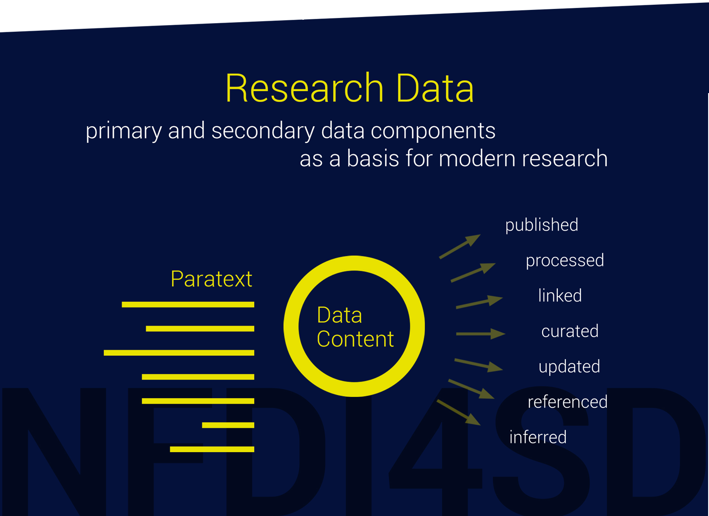

## Epistemology of research data

Research data are not an invention of the digital age: since antiquity they have been published and used in the history of scholarship as a distinct type of information. The localities and paths of the ancient world were listed in data catalogues, such as Ptolemy’s *Geography*, and scholars determined the constellation of the stars with the help of Ptolemy’s *Handy Tables*. Early calendars and the dating of religious festivals were also based on research data, while encyclopaedias provided summaries of standardised knowledge. Extensive collections of research data created the success of modern scholarship and science in combination with the development of grand theories, although, as these collections were mostly collaborative projects, they often did not bear an author’s name. Research data are epistemically verified with the greatest of care in all academic cultures. They are bodies of knowledge that are regularly examined to identify errors as quickly as possible and to mark the validated data. Thus, research data are not simply information that is disseminated on the Internet in our digital age, linked to other data and made accessible irrespective of its truthfulness. Nor are they ‘closed data’, which, like rarefied treasures, are only accessible to the privileged few.

The concept of knowledge was introduced by scholars to classify this special status of information about society and the world. With the generic nature of theory, we can characterize research data as the description of any class of objects that qualifies as knowledge. Research data as knowledge about the properties of research objects which have been methodologically evaluated by the academic community can therefore be distinguished from arbitrary information: research data are collaboratively, openly and critically examined; they represent a claim of validity that can be revised at any time. The organisation of scholarly communication and the ethos of dealing with knowledge are optimised in order to minimise errors. These established methodological mechanisms should apply to the research data of all disciplines.

This special status of research data, together with all the academic disciplines, including in particular the so-called small disciplines, is the main focus of the NFDI4SD’s challenge of developing an appropriate research data infrastructure.

!!! note "research data"
    **RD1**: Scholars and scientists consider research data to be fallible knowledge: they can be justified and can then serve as the basis for justifying statements; they can also qualify as epistemic states. To this end, they must be computationally identifiable at all times, independently of their symbolic form. All epistemic qualifications need to be transparent.

All the additional attributes that are used to handle research data as knowledge can be synthesised. Research data can be differentiated according to the components of the data’s content, the metadata and the epistemic knowledge claims qualification. The content of research data refers to the characteristics of the research objects described by the data. Research data always include both content and its additional attributes. As a result, an infrastructure of research data must assure and maintain data integrity.

We can draw an analogy between our understanding of research data and the concept of paratext (@zotero-40395), which has been debated in the past few years: according to the philologically based concept introduced by Gérard Genette (1930–2018), paratexts are those elements that have been added to the main text of an (originally literary) work and which decisively influence and control the reception and distribution of the work. These elements include information on the author, the publisher, the title, preface, acknowledgements, advertising, and so forth. [@genette1997] The concept of paratext, which directs greater attention to production processes and to cases of authorisation, was later extended to include various types of text and new media formats. In the context of the digitisation of research data, this means that the verification, authorisation and permanent accessibility of research data will have a particularly decisive influence on the adherence and further development of national and international standards and quality requirements.

!!! note "research data"
    **RD2**: Research data are composed of content, metadata and epistemic attributes. All the information on the data sources, such as main texts and paratexts, is unified within the research data. The composition of the data needs to adhere to epistemic principles in order to enhance the way in which knowledge is obtained, accessed and maintained.

It was the physicist and philosopher Hans Reichenbach (1891–1953) who codified the distinction between the context of discovery and the context of justification in connection with critically evaluating statements. The context of discovery takes into account the causes that lead to new insights being formed and the evaluation of scientific evidence. The basis for the justification of statements must be differentiated from the discovery of statements, regardless of whether they are theoretical hypotheses or the content of research data. Researchers who are looking for new answers and who create and use research data for this purpose, focus on the context of discovery. However, in doing so they overlook the fact that a discovery process is always based on knowledge that has already been justified. Research data are validated particularly carefully if they are being prepared for publication during the research process.

!!! note "research data"
    **RD3**: The value of research data must always be assessed according to how it will be reused by others and not from the perspective of the first person involved in the discovery process.

The justification of knowledge – and thus the validity of research data – is a collaborative task of the entire research community. Therefore, the research data infrastructure must provide the means to track the provenance of research data as well as the epistemic dependence on tertiary sources. This is rarely guaranteed at present.

!!! note "research data"
    **RD4**: The justification of the data by other research data should be as transparent and comprehensible as possible. A ‘dependency graph’ can show how research data is connected to other research data and thus clarify the epistemic dependencies between them. The academic assumptions that determine the validity of the research data should be clearly identifiable.

It thus follows that newly acquired data within an innovative research organisation must be made available to other academics as quickly and completely as possible if the data is to be epistemically possible. This act of transferring research data from the hands of individual researchers who are working in the context of discovery to the public has its own special term: *academic publication*.

!!! note "research data"
    **RD5**: Publication. The publishing of research data is the act of handing over compiled findings of data that were made in the discovery context to the academic community. Only then do the findings become justified knowledge. Research data is given the status of empirical findings only once they have been published. Research data publication leads to citable data sets, which are listed in the bibliographies of other authors, such as in current research literature.

The consequence is that research data publication is now being considered as early as possible in management planning. A strict sequence of processes, in which the publication of research data is planned only after the completion of a project and after all other activities have been finalised, is thus no longer logical from the point of view of academic theory; indeed, it adversely affects innovative research. The modified workflow of data publication and data citation will result in research projects gaining greater visibility, while the publication of one’s own data will significantly increase the impact of the project and the people involved in it.

!!! note "research data"
    **RD6** Citing research data. The origin of reused research data should always be cited. Research data should be cited, like any other scholarly source, in bibliographies or lists of references. The format of a data citation also resembles the reference styles of other bibliographical sources. Citations can be managed and administered in citation databases or by using citation tools.

During the course of a research project, a great deal of research data is created in relation to other data. The new data are annotated, linked or are used in other ways to further research. The scope of these research data is huge, yet currently very little of these data are published. These data sets considerably increase the usefulness of the linked data.

!!! note "research data"
    **RD7** Enhancing research data. Modern research projects create a rich and additional amount of research data during the research process.

## Institutional consequences: the use of FAIR principles

We understand the FAIR data principles to be a framework for developing an infrastructure that serves research data as a knowledge base with the purpose of creating a collaborative and open science.

In order to create the conditions for such a framework, a number of leading international research associations and institutions committed themselves to implementing the FAIR data principles. Increasingly, many funding bodies only allocate funds to projects that fulfil FAIR conditions. Today, however, these conditions cannot be guaranteed by researchers alone: research projects in the small disciplines that are managed in an agile and collaborative way in particular do not tend to have the resources to meet the special requirements of providing and using research data. A research-based infrastructure will be needed.

The FAIR principles can be interpreted in a variety of ways, but we intend to follow the proposals of the GO FAIR initiative, [^gofair]the vision of which is to foster ‘the coherent development of the global Internet of FAIR Data & Services (IFDS), with the main focus on early developments in the European Open Science Cloud (EOSC)’.[^gof1]

[^gofair]: [go fair](https://www.go-fair.org/go-fair-initiative/)

[^gof1]: [Go fair principles](https://www.go-fair.org/fair-principles/)

!!! note "research data"
    **RD8**: The FAIR principles (reproduced below from the GO FAIR website) regulate the technical implementation of research data. The NFDI4D will use these guidelines to implement its research data infrastructure. The guidelines are intended to ‘improve the Findability, Accessibility, Interoperability and Reuse of digital assets’:

## Findable

>The first step in (re)using data is to find them. Metadata and data should be easy to find for both humans and computers. Machine-readable metadata are essential for automatic discovery of datasets and services, so this is an essential component of the FAIRification process.

>F1. (Meta)data are assigned a globally unique and persistent identifier

>F2. Data are described with rich metadata (defined by R1 below)

>F3. Metadata clearly and explicitly include the identifier of the data they describe

>F4. (Meta)data are registered or indexed in a searchable resource

## Accessible

>Once the user finds the required data, s/he needs to know how can they be accessed, possibly including authentication and authorisation.

>A1. (Meta)data are retrievable by their identifier using a standardised communications protocol

>A1.1 The protocol is open, free, and universally implementable

>A1.2 The protocol allows for an authentication and authorisation procedure, where necessary

>A2. Metadata are accessible, even when the data are no longer available

## Interoperable

>The data usually need to be integrated with other data. In addition, the data need to interoperate with applications or workflows for analysis, storage and processing.

>I1. (Meta)data use a formal, accessible, shared, and broadly applicable language for knowledge representation

>I2. (Meta)data use vocabularies that follow FAIR principles

>I3. (Meta)data include qualified references to other (meta)data

## Reusable
>The ultimate goal of FAIR is to optimise the reuse of data. To achieve this, metadata and data should be well-described so that they can be replicated and/or combined in different settings.

>R1. (Meta)data are richly described with a plurality of accurate and relevant attributes

>R1.1. (Meta)data are released with a clear and accessible data usage license

>R1.2. (Meta)data are associated with detailed provenance

>R1.3. (Meta)data meet domain-relevant community standards

Many of the principles mentioned above are open to a number of interpretations. As a result, no technical specifications can be deduced from these regulations. Expressions for the release of and access to data, such as ‘released’ and ‘accessible’, do not give enough information on the procedures. The NFDI4SD’s partner Zenodo, which is hosted by CERN, has developed its own ‘best effort principles’. (s) A substantial part of the publishing of small- and medium-sized research data collections is expected to be done on the Zenodo platform. Larger collections will be stored in separate data repositories. To begin with, the larger collections will carry out Zenodo’s implementation proposals.

[^s]: The goal of an open-access infrastructure is prominently formulated in Plan S[[GS1\]](#_msocom_1) and has been placed on the agenda of many European academic institutions. The findings of a self-evaluation concerning these objectives are to be published, together with the determined metrics of the research data, on a regular basis.
[^]: [[GS1\]](#_msoanchor_1)Perhaps Plan S should be explained: (which requires that scientists and researchers working for state-funded organisations publish their work in open repositories or in journals available to all by 2021).
