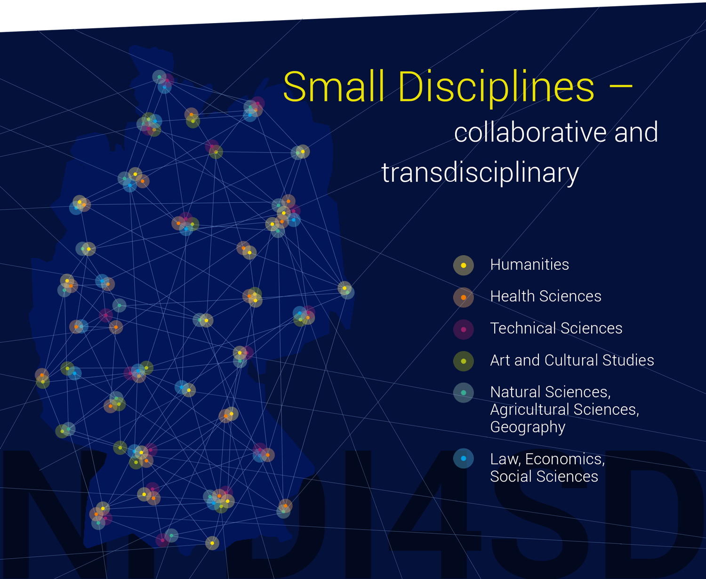
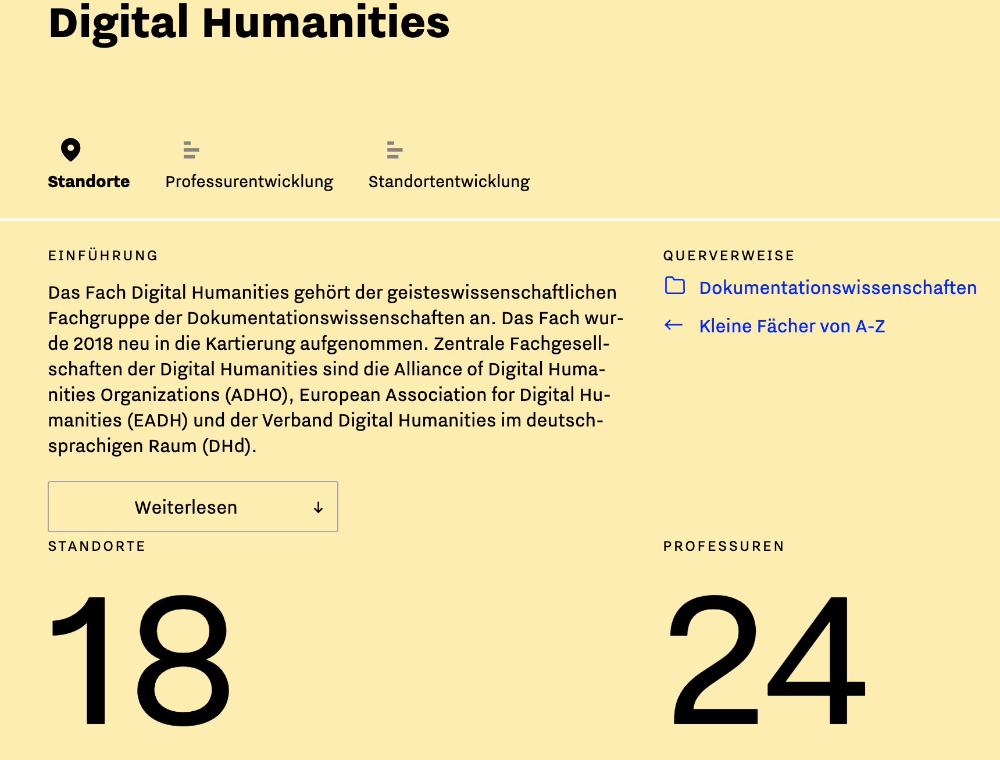
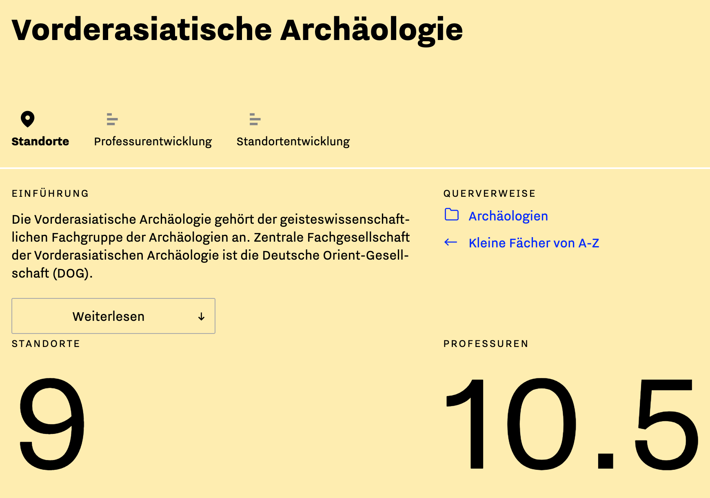
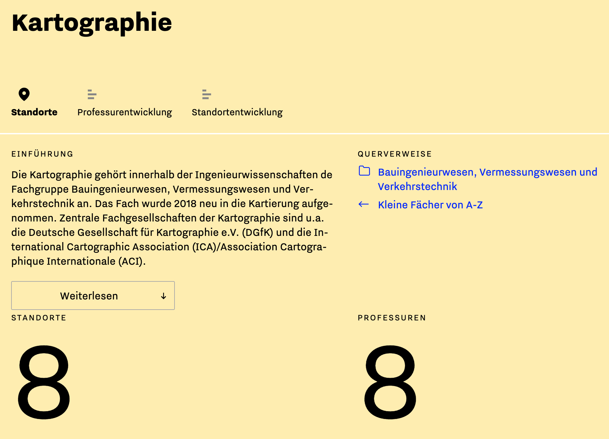
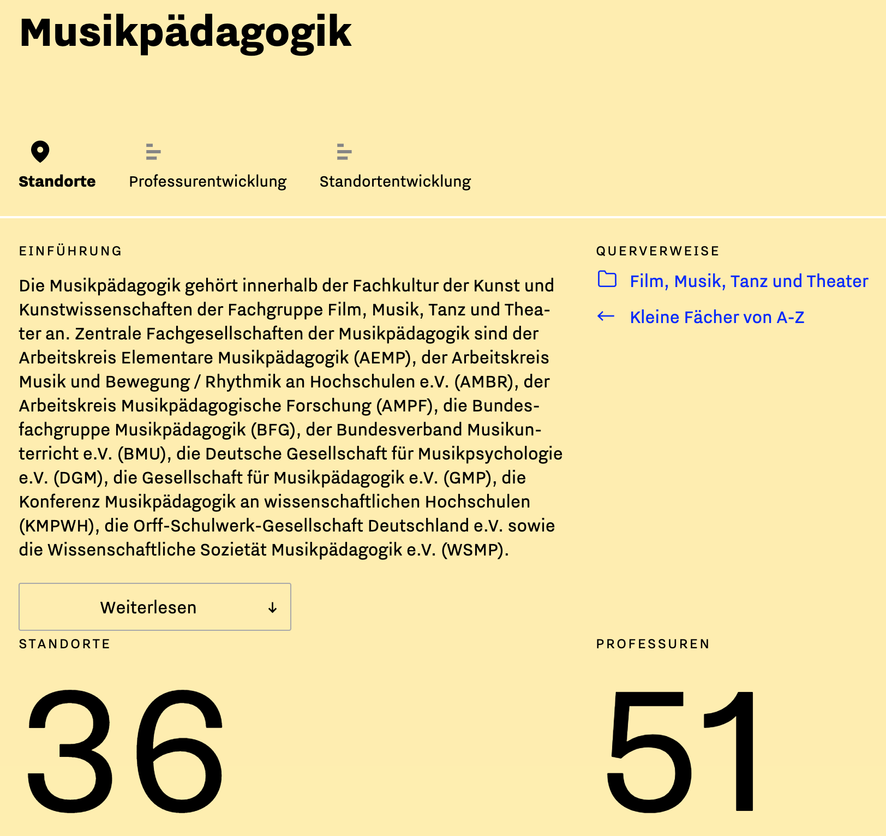
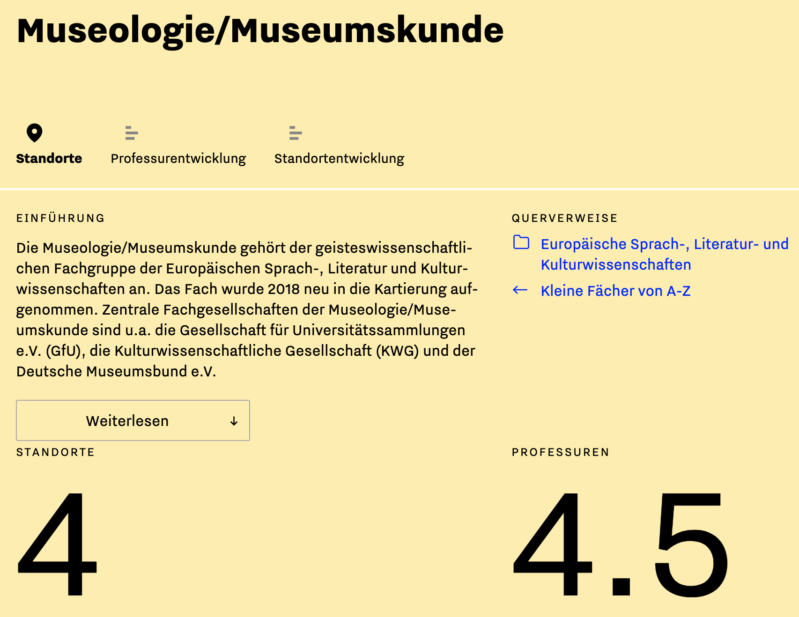
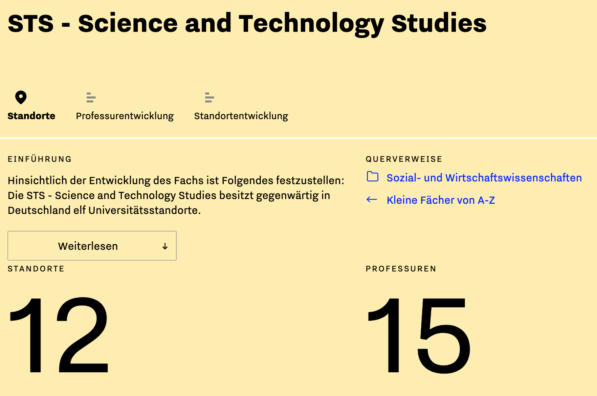
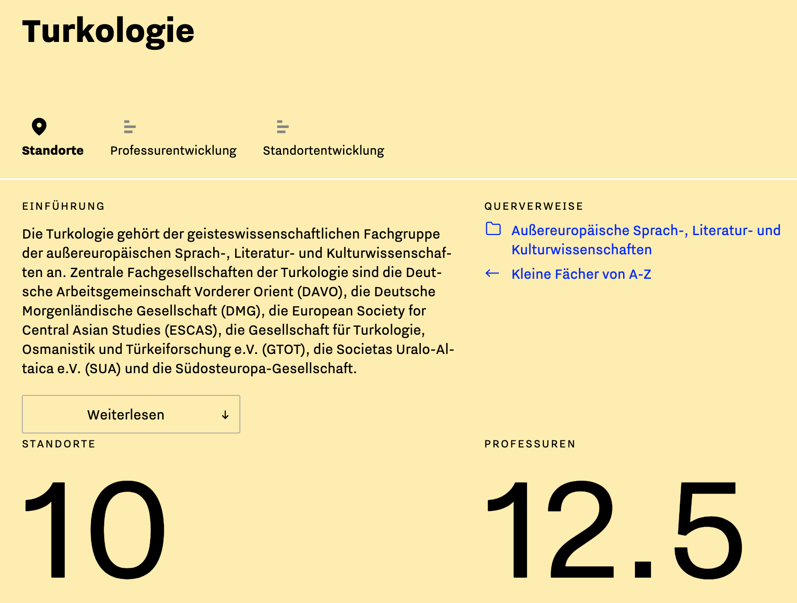
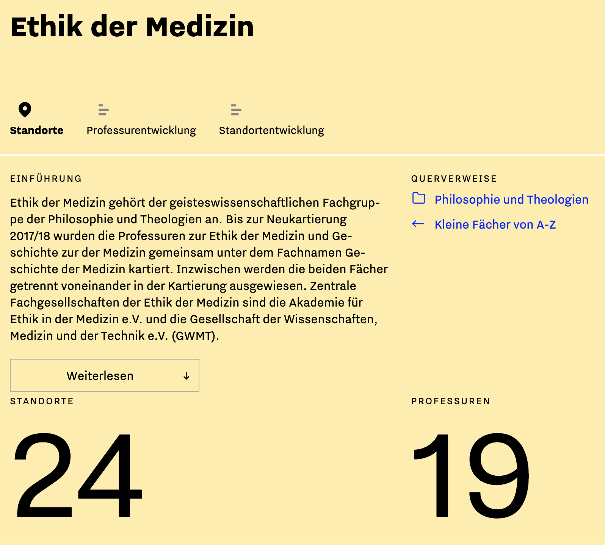
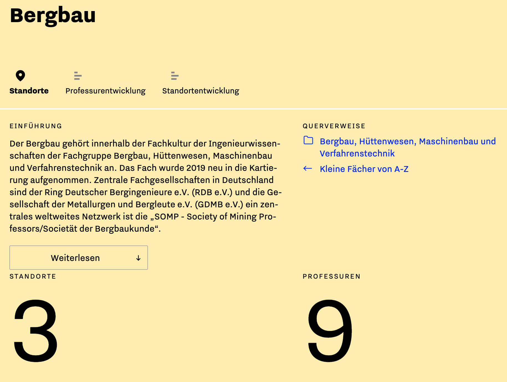

Ongoing digitalisation and the Open Access movement are transforming the research process and are greatly increasing the dissemination of research data. As a result, academic institutions – such as universities, research institutes but also smaller groups and agents – are increasingly committing themselves to managing research data sustainably and ensuring the interdisciplinary exchange of data. The initiative to establish a National Research Data Infrastructure, with the aim of reviewing the systematic planning, collection, processing, analysis, archiving, publication and exchange of data of various types to be reused by the scientific community and the general public, reflects this tremendous structural change.

The Humanities, Cultural Studies and Social Sciences in particular have been and continue to be faced with new challenges in this regard, since research data management and standardized data exchange are often less naturally integrated into their disciplinary divisions and infrastructures than in the case of the Life Sciences or Natural Sciences.

In Germany, the so-called small disciplines, which currently include more than 150 fields of study, mostly in the Humanities, Social and Cultural Sciences, find the challenges associated with these tasks particularly difficult to master. Neither the institutions nor the small disciplines are regarded as being mere sub-disciplines of a larger discipline.

[^1]: See the survey of the Arbeitsstelle Kleine Fächer (Small Disciplines’ Unit), Johannes Gutenberg University (JGU) Mainz , 2020; https://www.kleinefaecher.de/kartierung/kleine-faecher-von-a-z.html (last accessed on 30.08.2020).

The long-term funding and continued existence of these disciplines is a major objective of German higher education and research infrastructure in general. As the Federal Minister of Education and Research Anja Karliczek has emphasised: ‘The small disciplines provide valuable answers to the many important questions facing our society, not least of all what holds it together. They create significant knowledge and play a part in preserving our cultural heritage.’

[^2]: See ‘Small Disciplines – Great Potential’ on the Federal Ministry of Education and Research website: https://www.bmbf.de/de/kleine-faecher-grosse-potentiale-3261.html (last accessed on 30.08.2020).

!!! error "For further references please click image"

=== "Buchwissenschaft"
    

=== "Digital Humanities"
    

=== "Sinologie"
    

=== "Public Health"
    

=== "Vorderasiatische Archäologie"
    

=== "Kartographie"
    

=== "Wissenschaftsgeschichte"
    

=== "Osteuropastudien"
    

=== "Musikpädagogik"
    

=== "Numismatik"
    
=== "Geochemie"
    
=== "Mittellatein"
    
=== "Museologie"
    
=== "Science and Technology Studies"
    
=== "Turkologie"
    
=== "Ethik der Medizin"
    
=== "Japanologie"
    
=== "Bergbau"
    

However , when it comes to setting up modern research data infrastructures, the small disciplines do not have access to the resources of the institutions to which, as a rule, they are organisationally linked, or they cannot gain access to them to the extent necessary. They also lack the necessary resources and structures of their own to support the specific needs of their academic community with regard to modern research data management, to adapting existing practices to new standards and thus to implementing compatible, user-oriented concepts for the exchange, backup and reuse of data.

As the Arbeitsstelle Kleiner Fächer or Small Disciplines’ Unit of the Johannes Gutenberg University (JGU) in Mainz has stated, although the majority of small disciplines belong to the Humanities and Cultural Studies, which as a whole receive less external funding than other sectors, they receive a comparatively above-average proportion of third-party funding (unlike major subjects in Cultural Studies and the Humanities). This is the case in terms of both the number of applications and the approved funds, which can be taken to indicate that the small disciplines do indeed have a high need for additional funding.

[^3]: Hoffmann, Stefanie; Haas, Katharina; Bahlmann, Katharina; Schmidt, Uwe, 2019: Report on the state of mapping the small disciplines as part of the project, ‘The exchange of experiences, networking and encouraging the visibility of the small disciplines’, esp. pp. 18–23.

At present, there is no standardised higher education policy framework for the promotion of small disciplines in Germany: some states have initiated special programmes, while others have no measures at all. The respective professional associations or foundations have provided additional funding to the small disciplines.

[^4]: See the detailed information provided by the Small Disciplines’ Unit, JGU Mainz, 2020: https://www.kleinefaecher.de/rahmenbedingungen.html (last accessed on 30.08.2020).

A further factor to be considered is the highly collaborative and transdisciplinary working practices of the small disciplines. These are being investigated in ‘The Dynamics of Small Disciplines’, a research project funded by the Federal Ministry of Education and Research that runs from November 2019 to October 2022.

[^5]: See https://www.kleinefaecher.de/kartierung/arbeitsstelle-kleine-faecher.html.

These working methods concern not only the collaborative work undertaken between several small and/or medium disciplines, but also the teaching and supervision of young researchers. Given the breadth of topics and the variety of methods, many of the research questions and topics covered in the small disciplines can often only be  adequately addressed by interdisciplinary collaboration: innovations are typically achieved through cross-disciplinary and cross-cultural work in transnational exchanges. The provision of digital networking, the exchange of research data and a powerful and user-friendly infrastructure to help realise and expand these goals in the future are thus of huge importance.

**The small disciplines: formal criteria**

In order to differentiate the small disciplines from larger departments and sub-disciplines, the Small Disciplines’ Unit at JGU Mainz has developed a number of criteria

[^6]: These criteria serve as the working basis and definition of the Small Disciplines’ Unit. See https://www.kleinefaecher.de/kartierung/was-ist-ein-kleines-fach.html.

that will be used as the basis for determining the characteristics, user profiles and specific requirements when using research data. At present, the unit encompasses 157 small disciplines and 2,311 professorships at 89 locations throughout Germany. These small disciplines fall into six disciplinary divisions : (1) the Humanities; (2) Health Sciences; (3) Engineering and Technology; (4) Art and Art History/Aesthetics ; (5) Natural Sciences, Agricultural Sciences and Geography; and (6) Law, Economics and Social Sciences. They can be further divided into 19 sections .

[^7]: See Hoffmann, Stefanie; Haas, Katharina; Bahlmann, Katharina; Schmidt, Uwe, 2019: Report on the state of mapping the small disciplines as part of the project, ‘The exchange of experiences, networking and encouraging the visibility of the small disciplines’, esp. p. 9f.

More than half of the small disciplines are fields of study in the Humanities, followed at some distance by the disciplines listed in (5) and (6).

[^8]: See Hoffmann, Stefanie; Haas, Katharina; Bahlmann, Katharina; Schmidt, Uwe, 2019: Report on the state of mapping the small disciplines as part of the project, ‘The exchange of experiences, networking and encouraging the visibility of the small disciplines’, esp. p. 18.

A decisive factor in this context is that the specific interests of many of the disciplines grouped together in the six disciplinary divisions have so far not been addressed separately, if at all, which is due, in part at least , to a relatively pronounced dynamic in the field: new small disciplines, such as Digital Humanities or Biodiversity, are becoming established, while others are losing their status as ‘small’ disciplines, either because the fields of study are growing or because they are being absorbed into larger disciplines.

For a field of study to be considered a small discipline:

- there should be no more than three tenured professorships per location, although up to two exceptions are possible nationwide. The respective discipline will have its own professorships at specific appointment grades.

- there should be separate study programmes with a degree at the end. The respective academic discipline is represented at German universities with its own study programmes (Bachelor’s degree, Master’s degree, diploma, state exam).

- young academics, that is, those who have the potential to obtain a doctorate, should be selected and trained. Junior professorships, with the prospect of permanent or tenure-track positions, should be established.

**Social and communications criteria**

The small disciplines are no longer simply project-oriented but generally have an international and collaborative focus so that the thematically and structurally determined research requirements can be met. They also have a well-defined communications strategy that includes the use of appropriate types of media as well as a distinct approach for disseminating information to the general public. This includes:

- the belief in the small discipline as a subject in its own right: the professors who represent the respective branch of academic study at German universities see their fields of study as an independent subject.

- representation by a learned society: the respective branch of knowledge is represented by a national or international learned society. In exceptional cases, it may be acceptable that the field of study is recognized as an independent subject by a learned society. Crucially, this is a requirement of various institutions for access to funding and on which small disciplines are particularly dependent.

- professional journals and other forms of written communication: there should be a national or international specialist publication that represents the respective academic discipline.

**Target groups and their requirements**

The main objective of the NFDI4SD is to provide services and an infrastructure for all the small disciplines and the academic divisions and groups represented by them so that their scholars can realise their individual goals and projects through viable research data management. A service structure set up modularly according to the respective needs and requirements should be of great help. The various professional, communications and publication cultures of scholars and scientists need to be taken into account and should not be restricted by static and inflexible conditions and processes. In 2019, the sociologist Rudolf Stichweh described academic disciplines in the context of differentiation and dedifferentiation movements as highly dynamic communications systems: digitisation is thus intensifying the increasing emphasis in present-day research on project planning and a problem-centred way of working as is today’s growing demand for higher-level professional qualifications.

[^9]: See Szöllösi-Brenig, Vera: Report on the symposium, ‘Disciplines in motion – Differentiation and de-differentiation in the academic system?’, 2019, p. 2; https://www.volkswagenstiftung.de/sites/default/files/downloads/2019-05%20Bericht_Fächer-in-Bewegung.pdf (last accessed on 30.08.2020).

The NFDI4SD consortium will therefore include researchers from a number of different disciplines as well as interested institutions in the development process of the new infrastructure through, among other things, social media, the development, dissemination and evaluation of questionnaires on the desired service package and the tendering and funding of pilot projects. The knowledge and experience gained will be incorporated into the structure and development process of the NFDI4SD and will be evaluated successively. The aim is to make research data reusable through a number of different action strategies in order to avoid the data being lost owing to a lack of time, expertise or financial means.

At this juncture, another feature of the NFDI4SD makes itself known: projects at different stages of development, of varying sizes and with varying funding periods are explicitly addressed, from qualification projects, such as university theses and dissertations, to larger research groups at institutions or universities.

The publication of research findings, particularly in the case of doctoral theses, has, in many disciplines, so far been the primary indicator of the success of a research project, while the underlying data were not contextualized or systematically indexed. This meant that the data could not be cited in other academic studies without first having been reworked. In more extensive interdisciplinary research projects and collaborative work, the insights and partial findings gained through communicating with others and making evaluations from a number of different perspectives are of particular importance as they facilitate the publication of research data and partial findings. As a consequence, a stronger dynamic is developed, which benefits the entire research process.

**Desiderata**

 **D1** Review the sequential planning approach, which tends to place publication at the end of a research process and thus usually beyond the funding period

**D2** Create an infrastructure for archiving and publishing the data in the long term

**D3** Integrate the research data into a network of global data resources that supplement each other

**D4** Register applicable software solutions for standard computational workflows

**D5** Integrate expertise outside academia into a data network of specialized resources

**D6** Disseminate the research findings to the general public. Develop and implement quick and stable deployment strategies

**Additional references **

1. [Arbeitsstelle Kleine Fächer: Tagung „Kleine Fächer: Entwicklungen – Strategien – Perspektiven“, 12./13.09.2019](https://www.kleinefaecher.de/beitraege/blogbeitrag/dokumentation-zur-tagung-kleine-faecher-entwicklungen-strategien-perspektiven.html),
2. [Sylvia Paletschek: Der Blick der Universitätsgeschichte auf die Kleinen Fächer, Tagung „Kleine Fächer: Entwicklungen – Strategien – Perspektiven“, 2019](https://www.kleinefaecher.de/fileadmin/user_upload/img/Abschlusstagung_2019_Der_Blick_der_Universitaetsgeschichte_auf_die_Kleinen_Faecher_Paletschek.pdf)
3. [Mechthild Dreyer: Strategische Weiterentwicklung Kleiner Fächer. Resümee der Empfehlungen
    der Workshops Januar/Oktober 2018](https://www.kleinefaecher.de/fileadmin/user_upload/img/Abschlusstagung_2019_Strategische_Weiterentwicklung_Kleiner_Faecher_Dreyer.pdf)
4. [Arbeitsstelle Kleine Fächer: Kartierungsbericht 2019](https://www.kleinefaecher.de/fileadmin/user_upload/img/Kartierungsbericht_2019.pdf)
5. [Vera Szöllösi-Brenig: Bericht zum Symposium "Fächer in Bewegung – Differenzierung und Entdifferenzierung im System der Wissenschaft?", 2019](https://www.volkswagenstiftung.de/sites/default/files/downloads/2019-05%20Bericht_Fächer-in-Bewegung.pdf)
6. [Antonio Loprieno: Kleine Fächer und große Aussichten. Fachtagung der Arbeitsstelle Kleine Fächer, Mainz 2019](https://www.kleinefaecher.de/fileadmin/user_upload/img/Abschlusstagung_2019_Eroeffnungsvortrag_Kleine_Faecher_grosse_Aussichten_Loprieno.pdf)
7. [Förderrichtlinen für Kleine Fächer, BMBF, 25.07.2019](https://www.bmbf.de/foerderungen/bekanntmachung-2604.html)
8. [Informations- und Vernetzungsworkshop, Digitalisierung in Lehre und Forschung kleiner Fächer im Rahmen des Projekts „Die Dynamik kleiner Fächer“ 5. November 2020](https://www.dropbox.com/s/6yza1yuih8cvjzx/Programm_Digitalisierungsworkshop_kleine_F%C3%A4cher_Nov_digital.pdf?dl=0)
