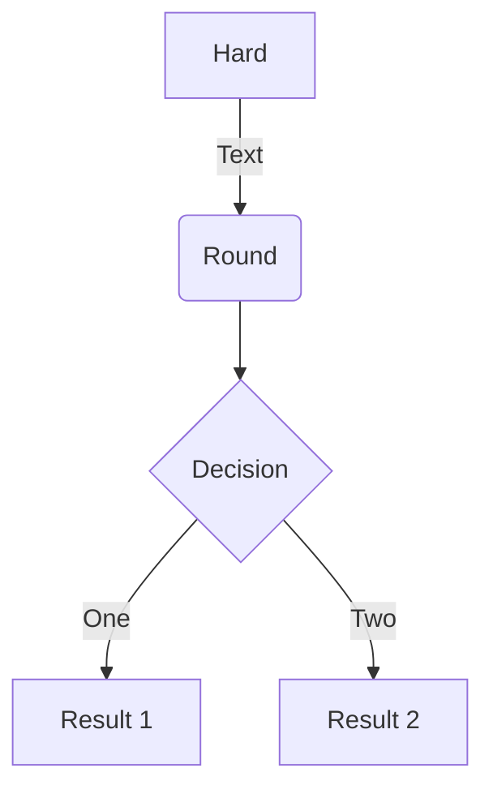

# NFDI 4 Small Disciplins (NFDI4SD)

Die Dokumente dieser Webseite dienen der kollaborativen Abfassung des Antrags für die Einrichtung eines NFDI. Dieser Seite finden Sie Links und weitere Hinweise auf die Bearbeitung der Dateien.

## Editing documents

  - Die Dokumente liegen im Unterverzeichnis docs

  ``` python
  mkdocs.yml    # The configuration file.
      docs/
          concept/..   # Dateien für die Zielsetzung, Arbeitsorganisation und grundlegende Konzepte
          cube/..      # Infrastruktur
          usecases/..  # Anwendungsfällle verschiedener Fächer
          index.md     # The documentation homepage.
          ...          # Other markdown pages, images and other files.
```

## Markdown

* [Markdown](https://facelessuser.github.io/PyMdown/user-guide/markdown-syntax/)
* https://github.com/facelessuser/pymdown-extensions/blob/master/mkdocs.yml
* Attribute List: https://python-markdown.github.io/extensions/attr_list/
* Pages, directory: https://github.com/lukasgeiter/mkdocs-awesome-pages-plugin
* Admonitions / Blocks / Fences/ Animations: https://squidfunk.github.io/mkdocs-material/reference/admonitions/



## Format

* [Colors](https://squidfunk.github.io/mkdocs-material/setup/changing-the-colors/)
* [Icons](https://squidfunk.github.io/mkdocs-material/setup/changing-the-logo-and-icons/)

Erweiterungen wurden eingebaut, die Textverfassungen nach akademischen Standards erlauben. Neben der Web Präsentation sind die Texte auch direkt in ein Word Dokument und ein PDF

* [Admonitions](https://squidfunk.github.io/mkdocs-material/reference/admonitions/)
* [Extensions](https://facelessuser.github.io/pymdown-extensions/extensions/smartsymbols/)

* citations and bibliography:

[@piotrowski , S. 6.]

## Server Befehle

* `mkdocs new [dir-name]` - Create a new project.
* `mkdocs serve` - Start the live-reloading docs server.
* `mkdocs build` - Build the documentation site.
* `mkdocs -h` - Print help message and exit.

## Useful links

* [mkdocs.yml](https://github.com/squidfunk/mkdocs-material/issues/748)

# Bibliography

\bibliography
