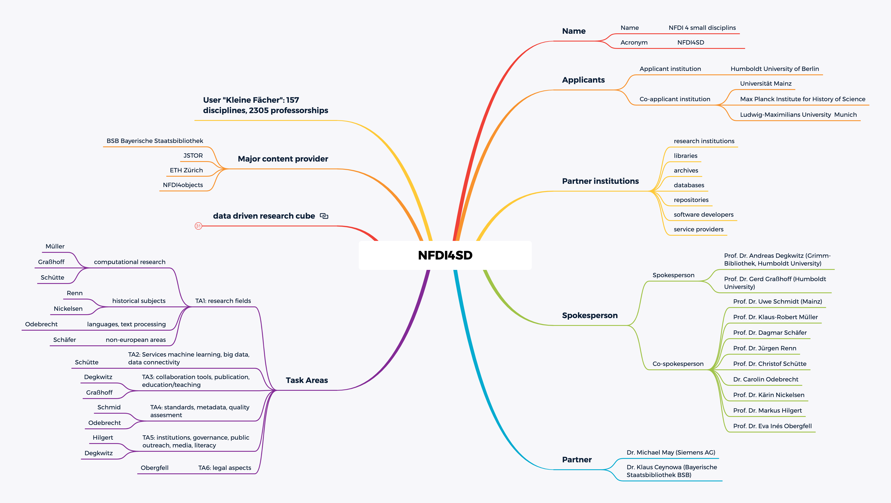

# Consortium

All spokespeople are members of the **steering committee** which regularly  reviews and decides per majority
- timeline of workpackages
- major working contracts
- user feedback and requests
- evaluation of performance metrics
- new members, partners, advisors, workshops and conferences
- spokespeople responsible for TAs and working packages report to the steering committee and place their proposal for consideration
- decide about annual budget
- The two spokespeople are responsible for the daily administrative decisions on issues which are defined by the **steering committee** at the inauguration of the NFDI4SD.

**task areas** have responsible spokespeople confirmed and assigned by the steering committee. Their goals and milestones are defined in the **table of tasks** submitted with the NFDI4SD proposal. Its composition will be reviewed and decided on by the **steering committee** annually, if needed on shorter notice.

A **scientific advisory board** will be elected with the inauguration of the NFDI4SD by the **steering committee**. It will advice the steering committee on requests and report to the body regularly.

The applicant institution is legaly responsible to the DFG. Budgets for staff employed by co-applicant institutions are transfered according to DFG procedures.

**Partner institutions** and **content provider** may signed contracts or letter of understanding for services for NFDI4SD such as access regulations and usage permits. These contracts are prepared by TA5 and administered by the applicatant instituion.

A **pilot period** from January 2021 until a project inauguration time will conduct workshops, review potential staff and organize meetings of the steering committee to consider recommendations for the inauguration meeting. External experts and advisors can be consulted for reviewing the working plan up to the inauguration of the NFDI4SD. Additional funding might support preparatory studies and developments.

# Forms and regulations:

  - [DFG NFDI Merkblätter](https://www.dfg.de/foerderung/programme/nfdi/formulare_merkblaetter/index.jsp)
  - [Funding criteria](https://www.dfg.de/formulare/nfdi120/nfdi120_en.pdf)
  - [Compliance form](https://www.dfg.de/formulare/nfdi130/nfdi130_en.pdf)
  - [Verwendungsrichtlinien](https://www.dfg.de/formulare/nfdi300/nfdi300_de.pdf)
  - [Elan flyer](https://www.dfg.de/download/pdf/foerderung/antragstellung/elan/flyer_eant_de.pdf)

# Budget summary

Staff will be appointed by the applicant institutions in line with the [Personalmittelsätze DFG](https://www.dfg.de/formulare/60_12/60_12_de.pdf). Institutions will supply the required working facilities. The main applicant institution will provide adminstrative facilities for the NFDI4SD. Co-applications will have no additional financial and structural obligation beyond these commitments as described in the submitted detailed budget plan. 
