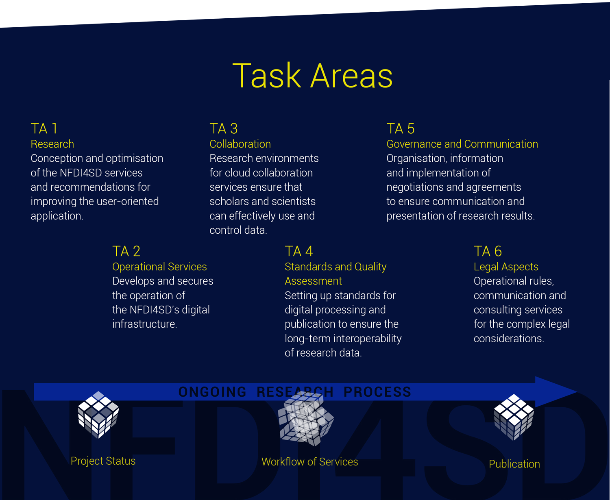

#

Digital transformation is fundamentally changing the way researchers work, particularly in the small disciplines. These scholars are typically involved in highly collaborative and global long-term projects that use innovative technology, but they often do not have access to the research data and publication infrastructure that their home institutions usually provide to researchers. Collaborative projects require agile workflows for all user groups. Data aggregation, preparation, processing, analyses and publications are all important elements of modern scholarly research. The main purpose of the NFDI4SD consortium is to provide scholars with research-integrating data together with other scientific support. By concentrating on the small disciplines, the consortium will be able to supply researchers with the services they require on a daily basis. The first objective will be to break up the traditional, sequential way in which the research procedure is organised and weave the research data, including publication of the data, into an integrated research process, complemented by a moderated research model that incorporates research data into the ongoing research workflow (or, as we call it, the ‘cube’).

## Objectives

!!! Objective
    **O1**: Both the use and production of research data will be tightly integrated into ongoing research projects. Since antiquity, science research has been an collaborative enterprise. The NFDI4SD’s services will become an integral part of current research, initially through the NFDI4SD entering into collaboration with new research projects. These agreements will be open to all disciplines, independent of their institutional classification as ‘small disciplines’.

Currently, the main desideratum of researchers working in the small disciplines is access to modern computational research data beyond the support of their home institutions and third-party funding bodies. As science is per se a collaborative undertaking, knowledge exchange is fundamental to developing innovative and critical science. As a support infrastructure, the NFDI4SD will be a novel institutional research partner in the scientific arena.

!!! Objective
    **O2**: The NFDI4SD will develop research data services that respond directly to the feedback of research projects. For many years now, the Arbeitsstelle Kleine Fächer (Small Disciplines’ Unit) has been recording the institutional framework of the small disciplines. It enables researchers, students, institutions and, in the future, the NFDI4SD to communicate directly with one another. New concepts in the computational philosophy of science will guide the software architecture of research data flows.

Computational tools develop at a rapid pace. NFDI4D aims to use the latest of those and motivate its researcher to deploy their own for common use as quickly as possible.

!!! Objective
    **O3**: The NFDI4SD will use and develop best-practice, open-source tools and computational libraries to provide their services within the European Open Science Cloud (EOSC).

The NFDI4SD will be an active member of the German NFDI consortium and will strive to form collaborations with other suitable consortia. It will commit itself to the strategic plans of the EOSC Roadmap and seek membership in the newly created EOSC Association. The proven infrastructure of CERN’s Zenodo platform will provide OpenAIRE data publication, data harvesting and it will adhere the FAIR data principles in order to realise the eight ambitions of Open Science.

!!! Objective
    **O4**: The signing of agreements with relevant stakeholders – libraries, archives and other content providers – on standards, application programming interfaces (APIs) and open access via computer networks.

The NFDI4SD governing body will seek to enter into operational agreements with a several content-providing institutions on the implementation and accessibility of APIs for the NFDI4SD’s infrastructure hub. These agreements, using widely accepted standards, will enable researchers to access large sets of research data from a large number of content-holding institutions. It is expected that, within a short space of time, the NFDI4SD will be able to provide standardised API and interface modules. The large variety of small disciplines involved will ensure that special collections beyond the significant stakeholders will be included in this integrated network of content providers.

!!! Objective
    **O5**: The NFDI4SD aims to maximise the visibility of the impact of research

New generation metrics monitors will be implemented to monitor the use and impact of the NFDI4SD’s services as part of the support offered to research projects. Daily, updated monitors and impact indicators will enable researchers to assess their collaborative global network as well as to inform the NFDI4SD’s governing body of hotspots of usage and of the need to steer users towards a particular course of action.

!!! Objective
    **O6**: Publication and science outreach

All output for general scholarly use will be regarded as publishable material. Such material goes beyond putting data on a file server: publications adhere to FAIR data principles and use review, curation and scholarly assessments. The NFDI4SD intends to establish new procedures and references for data publications so as to significantly enhance the impact of research.

## Task areas

The nature, benefits and characteristics of research data are surprisingly complex: data exist in many different media formats and contribute to the information value of the subject areas of research, while researchers benefit from the speedy dissemination of their publications and research findings, which leads to rapid knowledge exchange. A Research Management Plan will coordinate the use and interoperability of the NFDI4SD’s services. Internal and external forms of communicating for research purposes, data storage, usage and revision as well as full-page archiving, including the publication of the research findings and research data, will all form part of the NFDI4SD’s services.

The workflow of research activities in the context of highly collaborative, agile scientific communities occurs at the interplay between data and theory, using – among other things – computational means. Such activities can neither be ordered as a linear sequence of tasks, nor as a research data life cycle. The organisation of the workflow of research activities has been designed using Thomas Kuhn’s metaphor of science as a puzzle-solving activity. We describe the pipeline of scientific processes as the transformation of input data via research pipes into designed outcomes. This operational sequence can be compared to the rotations of a multidimensional research cube (solving Rubik’s cube, for example). The cube’s faces represent the content, data, skills, or means of the research activities. Each single step (that is, each rotation of the cube) leads to a new configuration.

This puzzle-solving metaphor facilitates the orchestration of the NFDI4SD’s services into research activities by organising and communicating the growing repertoire of the NFDI4SD’s numerous research data services. The cube describes the requirements, standards and quality of data as well as the information, metadata and documentation they contain, in order to assure the best usage of services. The NFDI4SD is basing its operation on a wide spectrum of standards, API norms, data formats as recommended by the EOSC and other standard institutions. The NFDI4SD will rapidly develop a user-friendly service catalogue that will serve as a graphical user interface (GUI) for researchers, who will be able to choose their needed service, quickly apply it to their given data and research questions and then obtain their findings.

!!! Task_area
    **TA1**: research

The aim of this large task area is to observe at close range the application of the NFDI4SD’s services and then to recommend the development of additional services to satisfy the demands of the various disciplines. TA1 will be supported by a broad range of fields, assisted by coordinators.

!!! Task_area
    **TA2**: operational services

This operational task area is to develop and secure the running of the NFDI4SD’s infrastructure, using Zenodo, Europe’s renowned research data publishing platform.

!!! Task_area
    **TA3**: collaboration

There is a rising demand for cloud collaboration services among today’s research environments. The direct exchange of information is being replaced by the publication of texts and data, with user interfaces ensuring that scholars and scientists can use and control data effectively, without having to undergo any special training. In addition, metadata as well as knowledge graphs, advanced catalogues and reference tools will enable users of the NFDI4SD’s services to make the most of open scientific data.

!!! Task_area
    **TA4**: standards and quality assessment

Data encoding, flow computers, computer interfaces, APIs and publications require widely applicable standards, norms and metadata. Our principal investigators (PIs) are long-term members of the key standardisation committees and so will ensure the interoperability of the research data over a long period of time.

!!! Task_area
    **TA5**: governance and communication

The highly experienced and international scientific representatives responsible for this TA will ensure that there is an effective information flow and that negotiations and agreements with research institutions around the world proceed smoothly. Virtual conferences, newsletters, blogs and, hopefully, physical meetings in the not-to-distant future should promote productive and effective science communication, including the transmission of science findings to the general public.

!!! Task_area
    **TA6**: legal aspects

Intense scientific collaborative work and the exchange of information, including the publication of data, involve complex legal considerations. This area will be tasked with preparing the operating rules, virtual information desks and consultation services. It will also actively shape the future legal landscape of the research process in the digital age.
