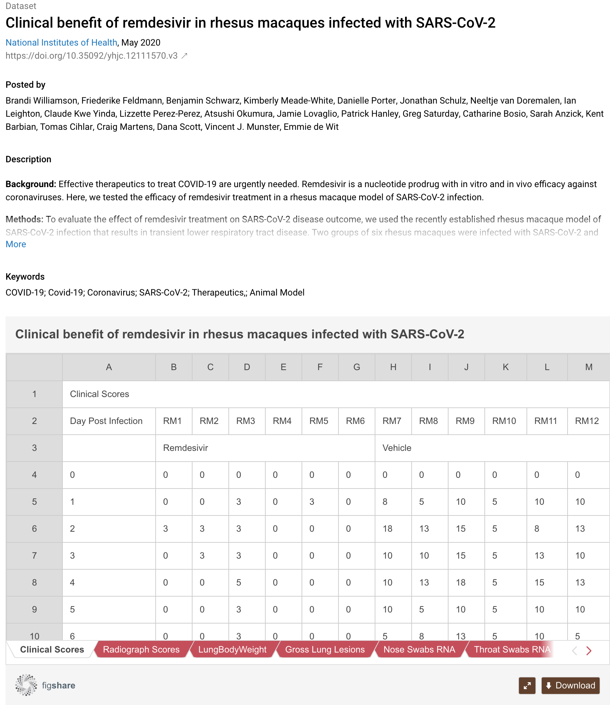

# Epistemology of research data

## Inferential networks

The epistemological analysis of the research data by NFDI4SD will be a novelty. Even in collections, research data are usually published grouped by categories in logical isolation. Missing are the inferential relations between them. Such research data are searched through catalogue instruments like filter categories. In an abstract space of research data, they can be visualised as objects with different colours and similarities expressed as spatial neighbourhood. Similar research data can be grouped by clustering of their spatial distribution.

The registry of the NFDI4SD extends browsing the fast-growing universe of research data. It uses machine learning methods to establish relationships between the data: inferential relationships of all kinds, including those of provenance. These networks are created for all globally catalogued research data, harvesting open data catalogues. The system will not only include those for which researchers have used the services of the NFDI. Similar datasets will be searched through the global web and linked like citation graphs of classical publications.

Deep learning models reveal the content and classify the research data on which the argumentation of the publications is epistemically based: computational derivations, subject similarity, or data type similarity. These searches are initially prepared for small subjects and can offer very substantial and specific support for the research projects.  The registry of the NFDI4SD creates a unique **epistemic knowledge graph for research data**.

These information graphs are basic for global research data collaborations.

## Epistemic qualification

The recent burst of data published in the context of research on COVID-19 proves urgent demands on an automated meta-analysis of data publication. But even in this research field - the opposite of a small discipline - the number of published secondary research data publication is small. A survey by dimension.ai (date 22. Sept 2020) lists as 5564 publications on Remdesivir+COVID-19 with 128 clinical trials, but only 7 datasets.

The size and complexity of these data are small:

Secondary research data for small disciplines are of similar composition. They are ideally suited for NFDI4SD ZENODO data repository. With its computational interface of NFDI4SD, it is possible to directly access the data and their paratext and analyse them with sophisticated methodological tools. These tools will be studied, developed and published by NFDI4SD. They allow answers to highly debated issues like:

- Our research data reproducible?[^rep]
- Which raw data are used?
- Do these research data justify the thesis?
- Which other research data confirm/contradict/refute/support the given research data?

[^rep]: Replication literature.

These are epistemological issues of research data which will be addressed and implemented as a service by NFDI4SD.

## Impact Analysis

Usage relationships between research data reveal the impact of research results for other researches. Research interests mainly use these features. It will inform about critical data dependencies, identify in particular scrutinised data sets and other epistemic qualifications. It will tell about empirical foundations of hypothesis and a potential lack of evidence.

