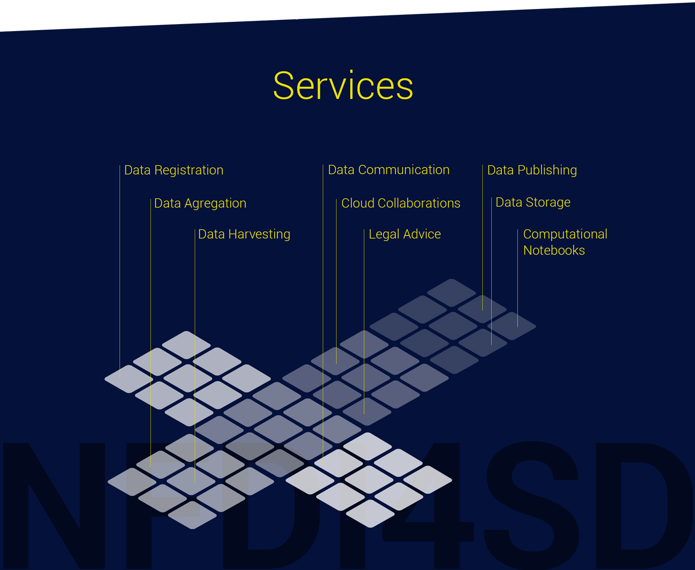

Services unterstützen die workflow der Bearbeitung von Forschungsdaten. Die meisten NFDI4D Services werden als Programmpakete in den Datenprozesse von computational notebooks aufgerufen. Es werden viele der open als open  Sie sind in Service-Klassen unterschieden, die wiederum eine Reihe von einzelnen Modulen enthalten. Ihre Parameter erlaubten ein hoch flexibles Pipelining der Services, so dass Ketten von Services miteinander verschränkt werden können und automatisierte Bearbeitungspipelines für Forschungsdaten eingerichtet werden können.

NFDI4SD develops a portfolio of cloud services being inspired by goog practive roles models.

## Competing proposals

### Registry of research data repositories

  - [re3data](https://www.re3data.org)

### Recommended Data repositories

    - [List of data repositories](https://figshare.com/articles/Scientific_Data_recommended_repositories_June_2015/1434640)

### Research data publications of publishing houses

  - [figshare](https://figshare.com/)
  - [Elsevier](https://www.elsevier.com/authors/author-resources/research-data)
  - [SpringerNature](https://www.springernature.com/de/authors/research-data)
  - [SpringerNature Data Journals](https://www.springernature.com/de/authors/research-data/research-data-publishing)
  - [ResearchDataPolicies](https://www.springernature.com/gp/authors/research-data-policy)
