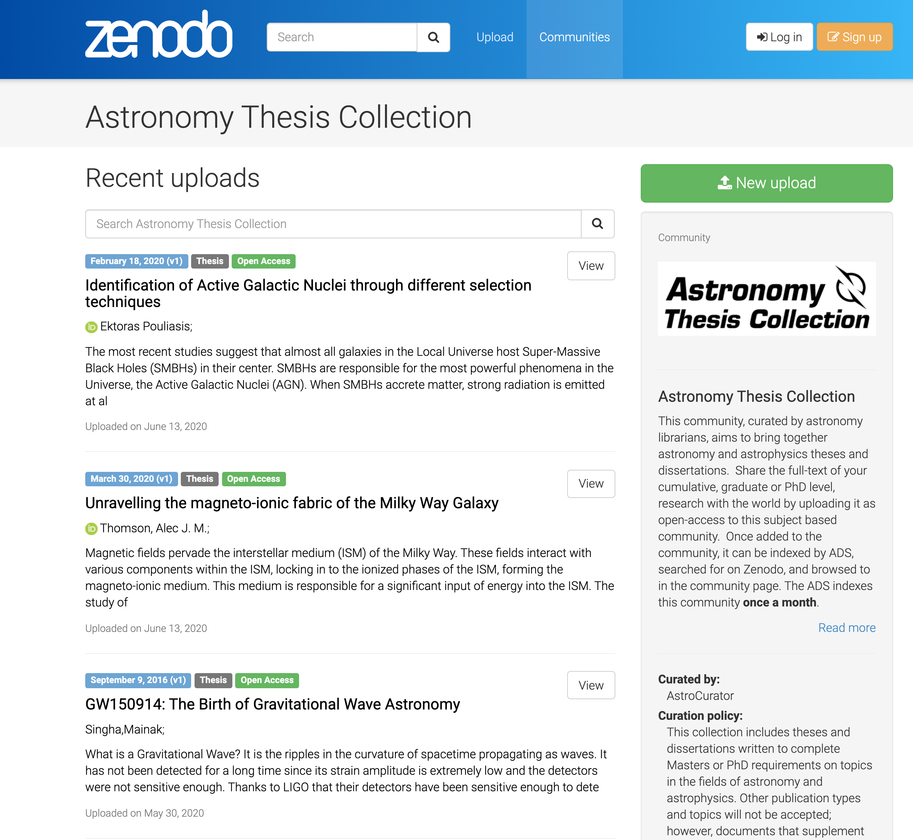

# Portfolio of NFDI4SD Services

Services unterstützen die Erstellung der Forschungsdaten und den workflow mit den Forschungsdaten. Sie sind in Service-Klassen unterschieden, die wiederum eine Reihe von einzelnen Modulen enthalten. Ihre Parameter erlaubten ein hoch flexibles Pipelining der Services, so dass Ketten von Services miteinander verschränkt werden können und automatisierte Bearbeitungspipelines für Forschungsdaten eingerichtet werden können.

## NFDI4SD visual notebooks mit ObservableHQ

Eine sich sehr schnell verbreitende Form von computational Notebooks sind interaktive Notebooks nach der open source plattform entwickelt von Mike Bostock - ObservableHQ. Als Chefentwickler der Infographics der New York Time perfektionieren diese Notebooks interaktive Infographiken. ObservableHQ ist ein Repositorium zur kollaborativen Entwicklung, Austausch und Weiterentwicklung von visuellen computational Notebooks. Die herausstechenden Graphiken der d3 Bibliothek sind führend im Design und Funktionalität. ObservableHQ eignen sich ideal zur Visualisierung und Kommunikation von Forschungsdaten. Aus diesem Grund nutzen führende Medienhäuser diese Komponenten, neben der New York Times auch Financial Times Graphics, die in kürzester Zeit mehr als 30 000 Infographiken publizierten. Über die API der NFDI4SD lassen sich Forschungsdaten direkt in die ObservableHQ importieren und visualisieren, ohne zwischengeschaltete deployments und Serverstrukturen.  

[Infographics Financial Times](https://www.ft.com/graphics)

[Manual](https://observablehq.com/@observablehq/user-manual)

### collaborative writing

One can collaboratively write and program computational notebooks in teams [Teamwork with computational notebooks](https://observablehq.com/@observablehq/fork-share-merge?collection=@observablehq/introduction)

### embedding

ObservableHQ können schnell und ohne weitere Infrastruktur in andere Medien eingebettet werden.

[Embedding](https://observablehq.com/@mbostock/embedded-notebook)

## Streamlit componente

[streamlkit-observable](https://discuss.streamlit.io/t/new-component-streamlit-observable-a-new-way-to-embed-observable-notebooks/5291)

### Computational data processing

  According to the principles of literate programming a range of supported types of computational notebooks <u>describe according to literature programming</u>

- Up- and downloading data will be facilitated by a [REST-API](https://developers.zenodo.org/#quickstart-upload)
-

# Datapublication

Creation of a DOI registered data submission on Zenodo ist straightforward and well established. Differenz procedures are well attested.[^doizen]

[^doizen]: [submitting to ZENODO](https://guides.github.com/activities/citable-code/)

## Services in a nutshell

  - :material-book-open-variant: **research data composition**
    - :material-book-open-variant: data aggregation
    - :material-book-open-variant: data normalisation
    - :material-book-open-variant: research data packaging
  - :material-book-open-variant: data aggregation

## Data Linking

## Citation manager

## Preparation services for publication

Data preparation serves different prerelease services to support researchs in their publication efforts:

  - Standardisierung
    - Vereinheitlichung
    - Transformation in äquivalente Formate
  - Companion
    - Prüfung von Datenintegrität, Vollständigkeit, Konsistenz

We encourage the use of a newly created *NFDI4SD Community Collections* for text and data publications. As an example: the SAO/NASA Astrophysics Data System supports the publication of astronomy thesis in [Zenodo's Astronomy Thesis Collection](https://zenodo.org/communities/astrothesis?page=1&size=20).

At the same time Zenodo both allows bulk uploading and harvesting its repositories. The policy allows NFDI4SD to implement a rapid <u>open science</u> publication workflow for its research bench implementation. A curated publishing setup from the implementation of NFDI4SD provides the best of two worlds for researchers using NFDI4SD services: research data will be curated and scrutinized by NFDI4SD research data compliances. Machine learning diagnostic tools support the composition of research data before they will be submitted for publication. Enhanced research metrics will supplement the NFDI4SD registry to document, display and facilitate collaborative usage of published research data by others.

## Data inspector

NFDI4SD will provide a data inspector component that serves complex research data inspections to variety of data formats (image, text, 3d, programs, databases). This component can be cited, open from the NFDI4SD website, be embedded in any other sites.

### Workflow and NFDI Cube

### Compare other solutions

  - [Elsevier](https://www.elsevier.com/authors/author-resources/research-data)
  - [SpringerNature](https://www.springernature.com/de/authors/research-data)
  - [SpringerNature Data Journals](https://www.springernature.com/de/authors/research-data/research-data-publishing)
  - [ResearchDataPolicies](https://www.springernature.com/gp/authors/research-data-policy)
  - [figshare](https://figshare.com/)

### Registry of research data repositories

  - [re3data](https://www.re3data.org)

### Recommended Data repositories

  - [List of data repositories](https://figshare.com/articles/Scientific_Data_recommended_repositories_June_2015/1434640)
