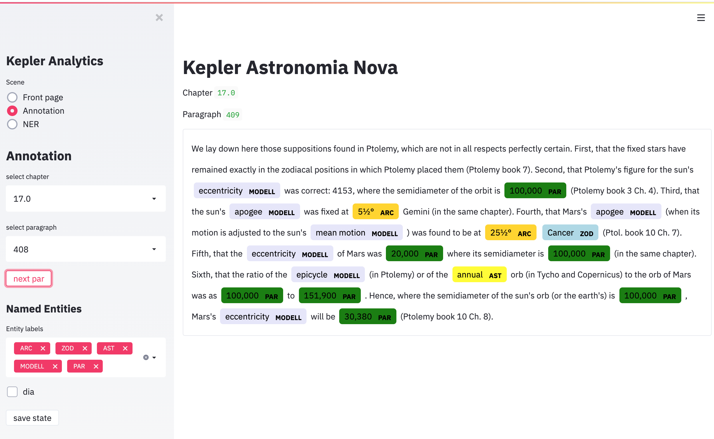

## Kepler' *Astronomia Nova*

| Project      | Reference                          |
| ----------- | ------------------------------------ |
|site     | [MPI Fellowship computational history of science](https://www.mpiwg-berlin.mpg.de/project/astronomy-early-modern) |
|project   | MPIWG, BIFOLD  |
|members    | Graßhoff/Mohammad Yeghaneh-Abkenar  |
|services | **:material-book-open-variant: NLP pipeline**,**:material-book-open-variant: semantic model**   |

Machine Learning today is able to semantically model historical scientific texts. These semantic models interpret texts and can identify, e.g.,  epistemological evaluations of the author, derive inferences from them or compare the author's conclusions about their conflicts with the statements of other contemporaries. Semantic text analyses do not only regard the expression, but rather refer to the content. The fine art of machine learning interpretation shifts the question from "what does the author write?" to "what does the author mean by his text?". Part of this task uses NFDI4SD service of **:material-book-open-variant: NLP pipeline** path of identifying name entities (NER) used to itentify semantic components. They link syntactic properties of a text fragment with a general semantic feature, e.g. the expressions of various coordinates Kepler mentiones. Ambiguities or subtle additional semantical will be resolved to identify the implicit year for those reported positions.

The use case demonstrates to the enormous potential of semantic modelling with automatic hermeneutics concerning the reading of Kepler’s *Astronomia Nova* which currently is developed by a research project of *BIFOLD Berlin Institute for Learning and Data*), project AP20.2.
Four steps show the use and transformation of research data:
(1)	Research Data import of the English reference edition of Astronomia Nova
a.	The digital text is linked to the scholarly edition
b.	The text of the translation is data-linked to the passages of the first edition of Kepler’s Latin original
(2)	NLP-pipeline (a set of natural language processing services provided by NFDI4SD) creates a new secondary research data with tagged linguistic entities of the English edition.
(3)	The semantic model relates content elements to sections of the NLP-Pipeline texts. This model cross-links semantic objects like date/time aspects of observations, events or abstract objects of Kepler’s discovery like forces or epicyclic models.
(4)	Use services from the visualisation library publish interactive graphic components related to the semantic models.
This general scheme is demonstrated by an exemplary
(a)	Browse through the paragraphs of Kepler’s book
(b)	Identify the years referred to in the paragraph
(c)	Show the lunar visibility calculated for that year on the spot.

No explicit year is mentioned in the text. Semantic modelling can unambiguously identify the year and could link the data with an interactive computational notebook for visualizing the visible lunar phases for Prague of the mentioned date of the textual passage under consideration. One can select interactively a year for comparing the lunar phases at different years to demonstrate implications the author wants to consider. Tools will be rapidly published by the community with supporting services from the NFDI4SD and could be instantly reused as open access tools for any other linked data.

  

  

