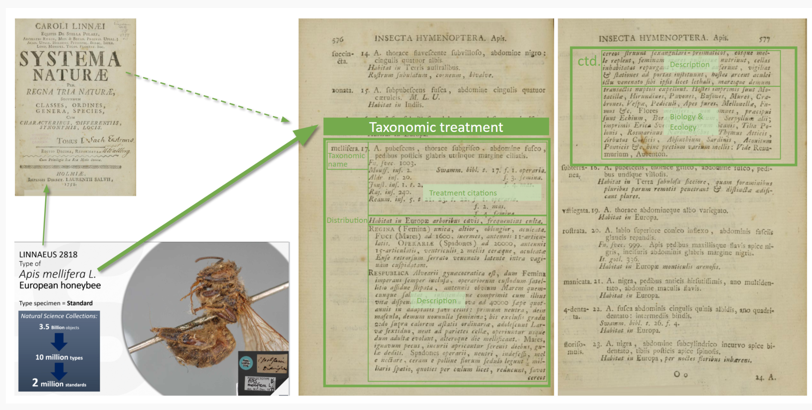
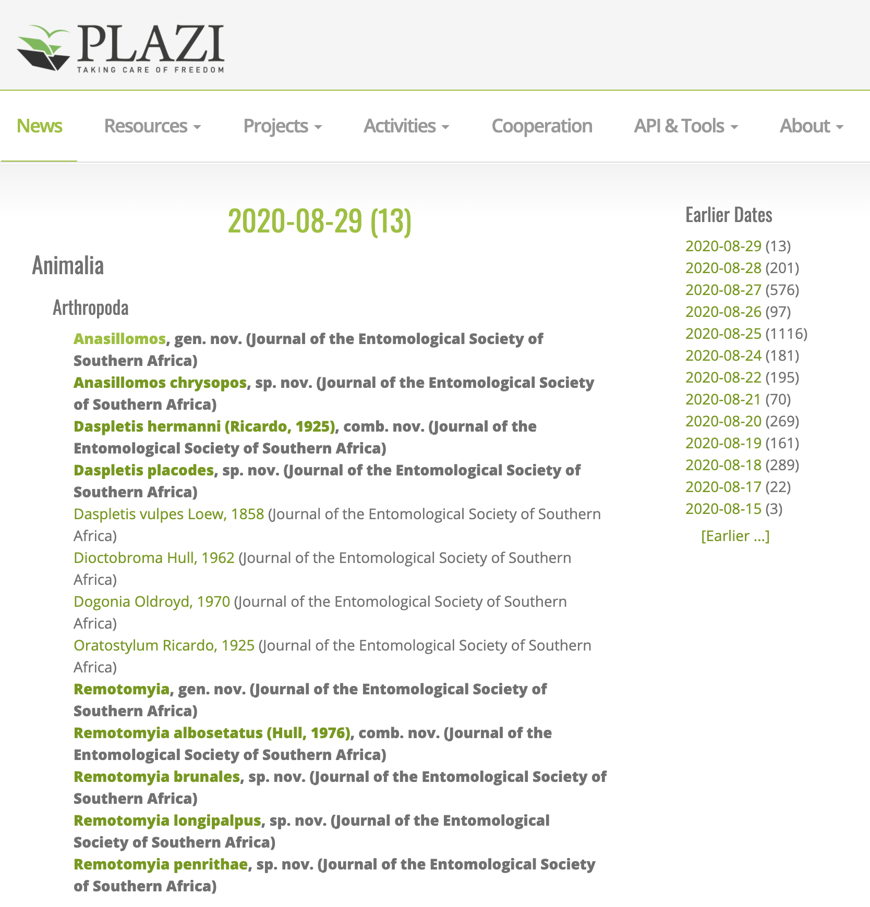

# Use Cases

## Purpose and demonstrations through use cases

Die thematische und methodische Vielfalt der kleinen Fächer wird anhand der User Cases vorgestellt. Diese Falldarstellungen sollen Aspekte des workflows, der als Transformation einer Konfiguration von Aspekten der Forschungsdaten typischerweise auftreten kann. Die use cases zeigen ausgewählte Services als Ausschnitt aus den Forschungsprozessen.

Kleiner Fächer ist durch ihre transdisziplinäre Arbeitsweise bei der Bearbeitung komplexer Forschungsfragen und -themen ausgezeichnet. Diese resultieren aus heterogenen Fachkulturen an der Schnittstelle verschiedener Disziplinen. Innovationen und die Erstellung einflussreicher Forschungsdaten werden typischerweise disziplinen- und kulturübergreifend verfolgt und benötigen in besonderem Maße eine digitale Vernetzung und die spezifische Infrastruktur, um dieses Ziel zu realisieren.

Die folgenden use cases stellen unterschiedliche Forschungsgebiete von Kollaboration, Autoren und Projekten mit beispielhaften Klassen von Forschungsobjekten und korrespondierenden Forschungsdaten dar. Sie sind entweder best praxis Fälle oder zeigen Anwendungsmöglichkeit der Einbindung von NFDI4SD Services in den Forschungsprozess bis zum Publikation und Weiternutzung. Es werden solche Services des NFDI4SD genannt, von denen wir erwarten, dass sie zukünftig für vergleichbare Forschungssituationen genutzt werden würden.

## Template use cases

Die use cases zeigen verschiedene Nutzungs- und Erstellungsszenarien für Forschungsdaten der unterschiedlichen Fachkulturen der Kleinen Fächer. Obwohl der Nutzungskontext der Forschungsdaten stark differiert, zeigt sich doch eine weitgehende

## Natural History, biological taxonomy, ecology

| Project      | Reference                          |
| ----------- | ------------------------------------ |
|site     | [Plazi](http://plazi.org/) |
|members    | [Member link](http://plazi.org/about/members/)   |
|active community |[Issue discussion](https://github.com/plazi/community/issues)   |
|cooperation  |[Datalinking institutions](http://plazi.org/cooperation/)   |
|normdata   |   |
|linked data   |[openbiodiv](http://graph.openbiodiv.net/)   |

!!!Success "Research objects"
    - Taxonomy
    - Literature

blockdiag {
  orientation=portrait

  aggregation [shape = diamond, stacked];
  Literature [shape=box, stacked];
  analysis [shape=box];
  publication [shape=diamond];
  "linked data" [shape=diamond,stacked]

  aggregation -> analysis -> "linked data";
  Literature ->  analysis -> publication;
}

=== "aggregation"
    

=== "analysis"
    

=== "composition"
    

=== "publication"
    ZENODO
    

=== "linked data"
    [OpenBiodiv-O website](ht6tp://openbiodiv.net/)

    > OpenBiodiv is an Open Biodiversity Knowledgement Management System (OBKMS), comprising a knowledge graph, a Linked Open Dataset, an ontology (OpenBiodiv-O) and а website (http://openbiodiv.net/). OpenBiodiv gathers biodiversity knowledge extracted from semantically enhanced biodiversity articles published by Pensoft and taxonomic treatments harvested by Plazi and exposes the links between and within articles and their content. The knowledge graph contains semantic statements about authors, articles, treatments, taxonomic names, examined materials, institutions, genomic sequences, habitats, localities, and more.[^obio]

[^obio]: [pensoft](https://pensoft.net/about#Company-profile)
